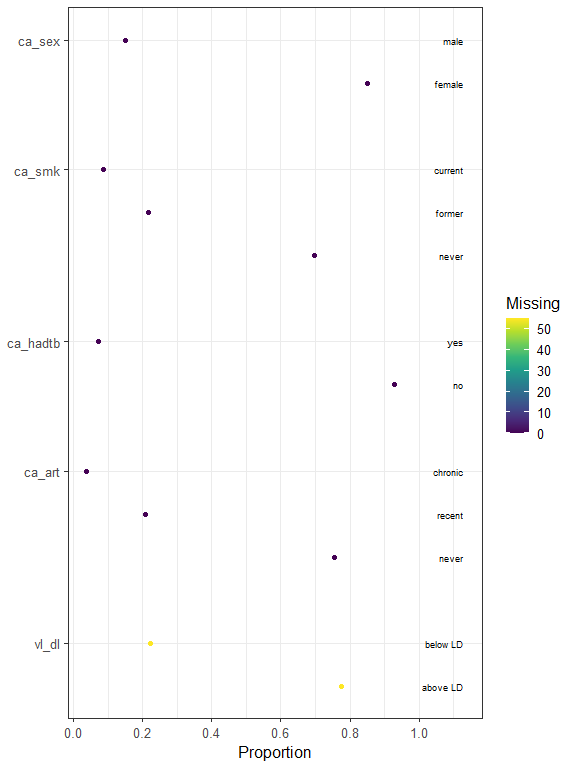
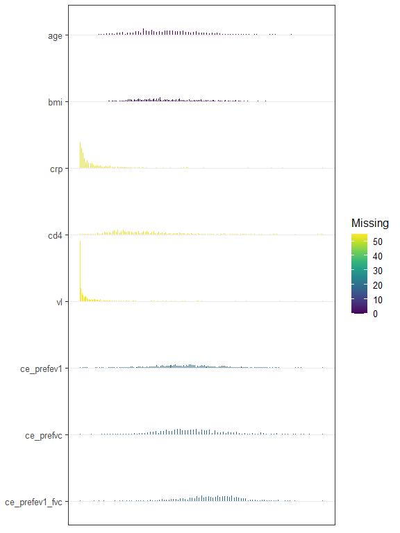
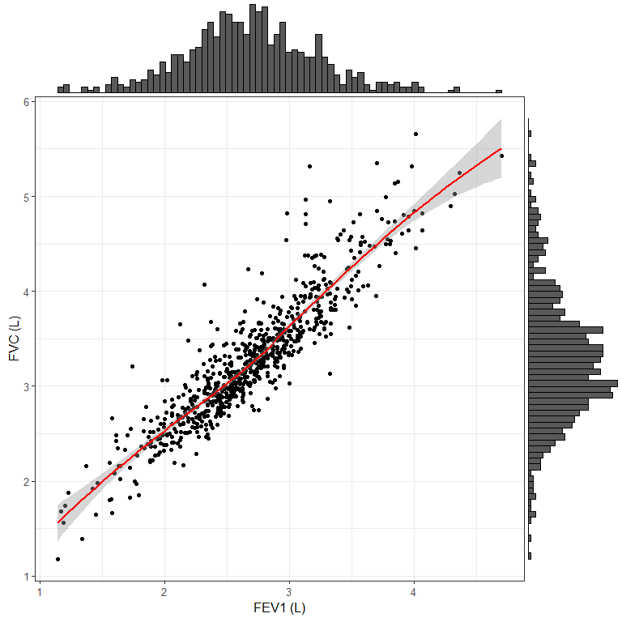
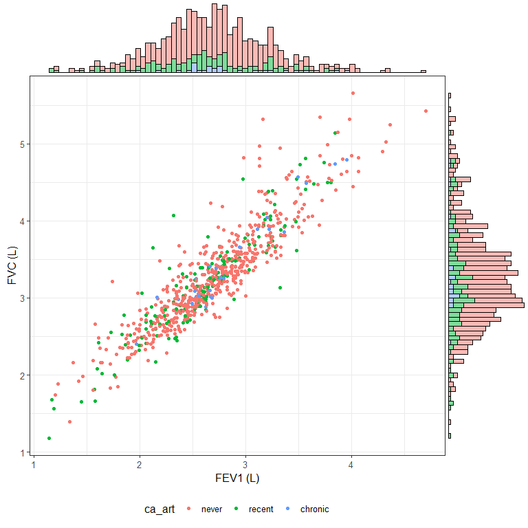
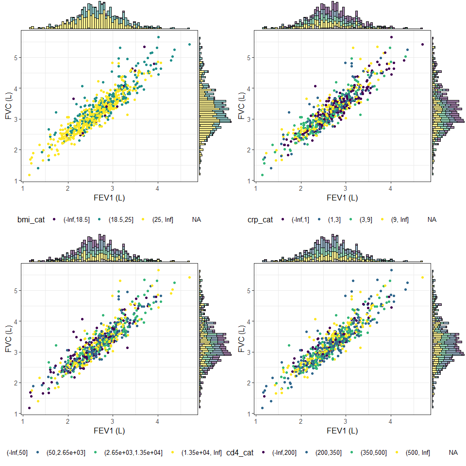
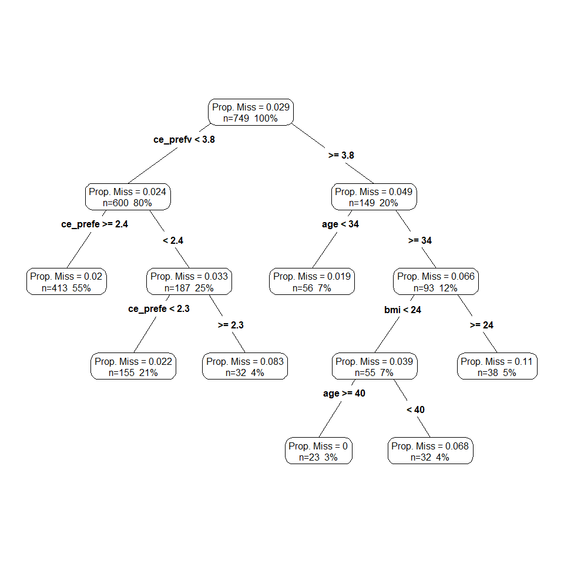
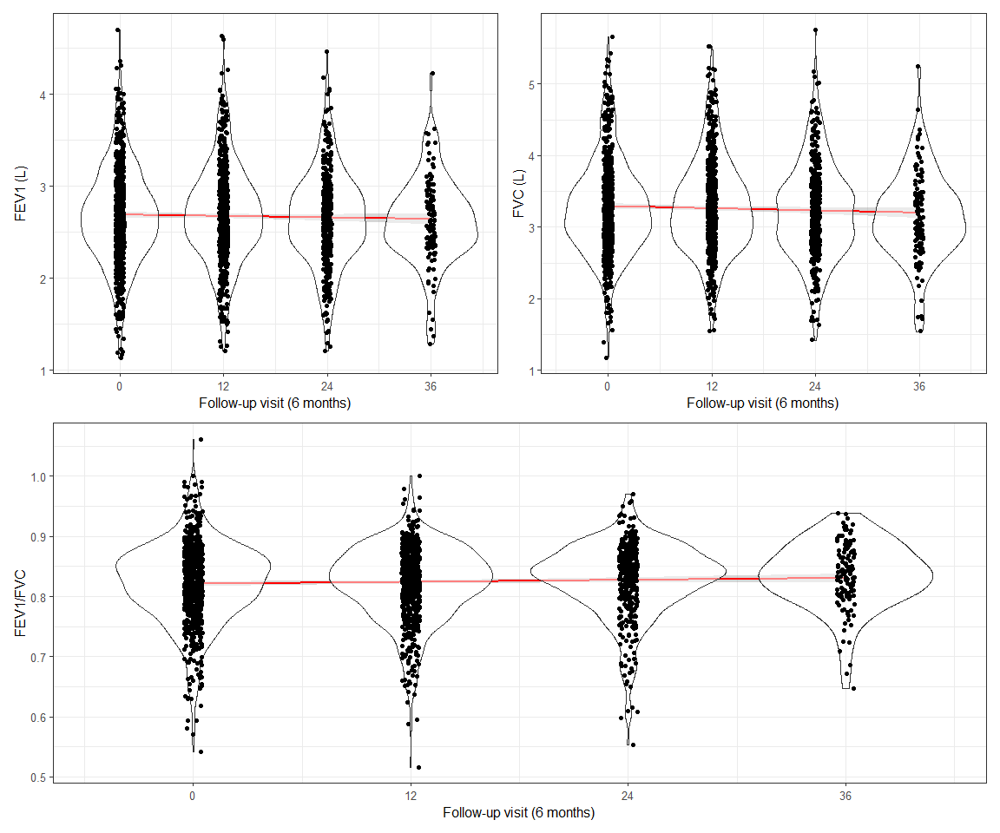
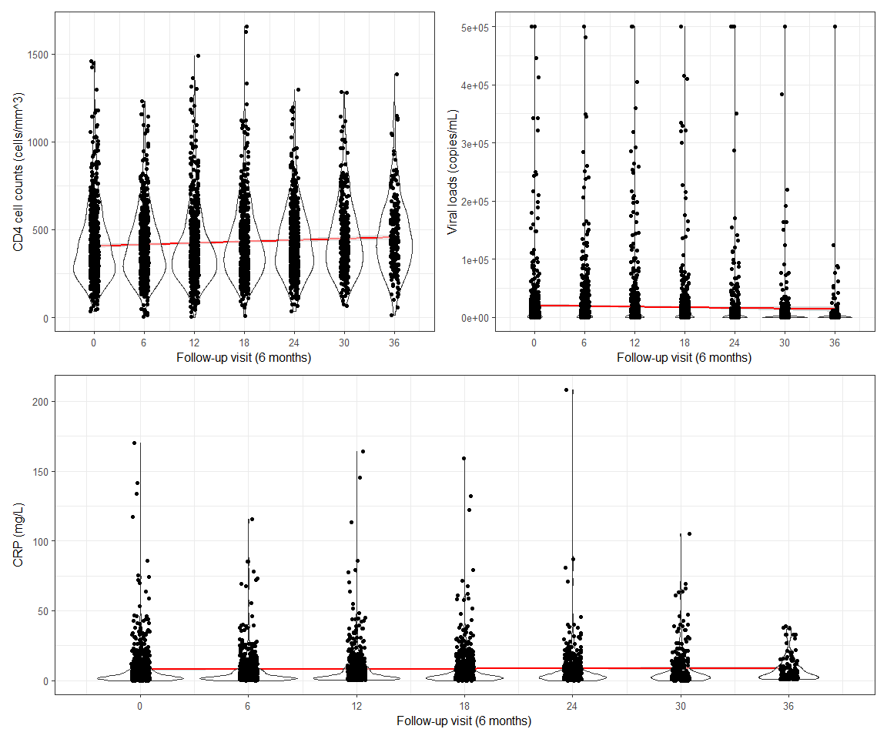

Pulmonary Impairment in HIV-infected South African Adults
================
2024-05-28

Load the packages:

``` r
library(tidyverse)
library(here)
library(Hmisc)
library(gtsummary)
library(naniar)
library(ggExtra)
library(patchwork)
library(gridExtra)
library(rpart)
library(rpart.plot)
theme_set(theme_bw(12))
```

Import the dataset:

``` r
p_hiv <- read_rds(here("case_studies", "pi_hiv", "pi_hiv_data.rds"))
```

# Baseline data description

Select the baseline dataset:

``` r
bs_d <- p_hiv |> 
  dplyr::filter(visit == 0)
```

Let’s have a very rough overview of the baseline dataset:

``` r
plot(describe(
  bs_d |> 
    dplyr::select(-c(ptid, visit)),
  exclude.missing = FALSE
))
```

    ## $Categorical

<!-- -->

    ## 
    ## $Continuous

<!-- -->

Some summary statistics on the dataset:

``` r
labels <- list(
  age ~ "Age (years)",
  ca_sex ~ "Sex",
  ca_smk ~ "Smoking status",
  ca_hadtb ~ "History of tuberculosis",
  bmi ~ "BMI (kg/m^2)",
  ca_art ~ "Has the subject ever been on ART?",
  crp ~ "CRP (mg/L)",
  vl ~ "Viral loads (copies/mL)",
  vl_dl ~ "Viral loads DL",
  ce_prefev1 ~ "FEV1 (L)",
  ce_prefvc ~ "FVC (L)",
  ce_prefev1_fvc ~ "FEV1/FVC"
)

bs_d |> 
  dplyr::select(-c(ptid, visit)) |> 
  tbl_summary(
    label = labels,
    statistic = list(
      all_continuous() ~ "[{p10}; {p25}; {median}; {p75}; {p90}] - {mean} ({sd})",
      all_categorical() ~ "{n} ({p}%)"
    ),
    missing = "always",
    missing_text = "(Missing)"
  )
```

<div id="yyjocvgodu" style="padding-left:0px;padding-right:0px;padding-top:10px;padding-bottom:10px;overflow-x:auto;overflow-y:auto;width:auto;height:auto;">
<style>#yyjocvgodu table {
  font-family: system-ui, 'Segoe UI', Roboto, Helvetica, Arial, sans-serif, 'Apple Color Emoji', 'Segoe UI Emoji', 'Segoe UI Symbol', 'Noto Color Emoji';
  -webkit-font-smoothing: antialiased;
  -moz-osx-font-smoothing: grayscale;
}
&#10;#yyjocvgodu thead, #yyjocvgodu tbody, #yyjocvgodu tfoot, #yyjocvgodu tr, #yyjocvgodu td, #yyjocvgodu th {
  border-style: none;
}
&#10;#yyjocvgodu p {
  margin: 0;
  padding: 0;
}
&#10;#yyjocvgodu .gt_table {
  display: table;
  border-collapse: collapse;
  line-height: normal;
  margin-left: auto;
  margin-right: auto;
  color: #333333;
  font-size: 16px;
  font-weight: normal;
  font-style: normal;
  background-color: #FFFFFF;
  width: auto;
  border-top-style: solid;
  border-top-width: 2px;
  border-top-color: #A8A8A8;
  border-right-style: none;
  border-right-width: 2px;
  border-right-color: #D3D3D3;
  border-bottom-style: solid;
  border-bottom-width: 2px;
  border-bottom-color: #A8A8A8;
  border-left-style: none;
  border-left-width: 2px;
  border-left-color: #D3D3D3;
}
&#10;#yyjocvgodu .gt_caption {
  padding-top: 4px;
  padding-bottom: 4px;
}
&#10;#yyjocvgodu .gt_title {
  color: #333333;
  font-size: 125%;
  font-weight: initial;
  padding-top: 4px;
  padding-bottom: 4px;
  padding-left: 5px;
  padding-right: 5px;
  border-bottom-color: #FFFFFF;
  border-bottom-width: 0;
}
&#10;#yyjocvgodu .gt_subtitle {
  color: #333333;
  font-size: 85%;
  font-weight: initial;
  padding-top: 3px;
  padding-bottom: 5px;
  padding-left: 5px;
  padding-right: 5px;
  border-top-color: #FFFFFF;
  border-top-width: 0;
}
&#10;#yyjocvgodu .gt_heading {
  background-color: #FFFFFF;
  text-align: center;
  border-bottom-color: #FFFFFF;
  border-left-style: none;
  border-left-width: 1px;
  border-left-color: #D3D3D3;
  border-right-style: none;
  border-right-width: 1px;
  border-right-color: #D3D3D3;
}
&#10;#yyjocvgodu .gt_bottom_border {
  border-bottom-style: solid;
  border-bottom-width: 2px;
  border-bottom-color: #D3D3D3;
}
&#10;#yyjocvgodu .gt_col_headings {
  border-top-style: solid;
  border-top-width: 2px;
  border-top-color: #D3D3D3;
  border-bottom-style: solid;
  border-bottom-width: 2px;
  border-bottom-color: #D3D3D3;
  border-left-style: none;
  border-left-width: 1px;
  border-left-color: #D3D3D3;
  border-right-style: none;
  border-right-width: 1px;
  border-right-color: #D3D3D3;
}
&#10;#yyjocvgodu .gt_col_heading {
  color: #333333;
  background-color: #FFFFFF;
  font-size: 100%;
  font-weight: normal;
  text-transform: inherit;
  border-left-style: none;
  border-left-width: 1px;
  border-left-color: #D3D3D3;
  border-right-style: none;
  border-right-width: 1px;
  border-right-color: #D3D3D3;
  vertical-align: bottom;
  padding-top: 5px;
  padding-bottom: 6px;
  padding-left: 5px;
  padding-right: 5px;
  overflow-x: hidden;
}
&#10;#yyjocvgodu .gt_column_spanner_outer {
  color: #333333;
  background-color: #FFFFFF;
  font-size: 100%;
  font-weight: normal;
  text-transform: inherit;
  padding-top: 0;
  padding-bottom: 0;
  padding-left: 4px;
  padding-right: 4px;
}
&#10;#yyjocvgodu .gt_column_spanner_outer:first-child {
  padding-left: 0;
}
&#10;#yyjocvgodu .gt_column_spanner_outer:last-child {
  padding-right: 0;
}
&#10;#yyjocvgodu .gt_column_spanner {
  border-bottom-style: solid;
  border-bottom-width: 2px;
  border-bottom-color: #D3D3D3;
  vertical-align: bottom;
  padding-top: 5px;
  padding-bottom: 5px;
  overflow-x: hidden;
  display: inline-block;
  width: 100%;
}
&#10;#yyjocvgodu .gt_spanner_row {
  border-bottom-style: hidden;
}
&#10;#yyjocvgodu .gt_group_heading {
  padding-top: 8px;
  padding-bottom: 8px;
  padding-left: 5px;
  padding-right: 5px;
  color: #333333;
  background-color: #FFFFFF;
  font-size: 100%;
  font-weight: initial;
  text-transform: inherit;
  border-top-style: solid;
  border-top-width: 2px;
  border-top-color: #D3D3D3;
  border-bottom-style: solid;
  border-bottom-width: 2px;
  border-bottom-color: #D3D3D3;
  border-left-style: none;
  border-left-width: 1px;
  border-left-color: #D3D3D3;
  border-right-style: none;
  border-right-width: 1px;
  border-right-color: #D3D3D3;
  vertical-align: middle;
  text-align: left;
}
&#10;#yyjocvgodu .gt_empty_group_heading {
  padding: 0.5px;
  color: #333333;
  background-color: #FFFFFF;
  font-size: 100%;
  font-weight: initial;
  border-top-style: solid;
  border-top-width: 2px;
  border-top-color: #D3D3D3;
  border-bottom-style: solid;
  border-bottom-width: 2px;
  border-bottom-color: #D3D3D3;
  vertical-align: middle;
}
&#10;#yyjocvgodu .gt_from_md > :first-child {
  margin-top: 0;
}
&#10;#yyjocvgodu .gt_from_md > :last-child {
  margin-bottom: 0;
}
&#10;#yyjocvgodu .gt_row {
  padding-top: 8px;
  padding-bottom: 8px;
  padding-left: 5px;
  padding-right: 5px;
  margin: 10px;
  border-top-style: solid;
  border-top-width: 1px;
  border-top-color: #D3D3D3;
  border-left-style: none;
  border-left-width: 1px;
  border-left-color: #D3D3D3;
  border-right-style: none;
  border-right-width: 1px;
  border-right-color: #D3D3D3;
  vertical-align: middle;
  overflow-x: hidden;
}
&#10;#yyjocvgodu .gt_stub {
  color: #333333;
  background-color: #FFFFFF;
  font-size: 100%;
  font-weight: initial;
  text-transform: inherit;
  border-right-style: solid;
  border-right-width: 2px;
  border-right-color: #D3D3D3;
  padding-left: 5px;
  padding-right: 5px;
}
&#10;#yyjocvgodu .gt_stub_row_group {
  color: #333333;
  background-color: #FFFFFF;
  font-size: 100%;
  font-weight: initial;
  text-transform: inherit;
  border-right-style: solid;
  border-right-width: 2px;
  border-right-color: #D3D3D3;
  padding-left: 5px;
  padding-right: 5px;
  vertical-align: top;
}
&#10;#yyjocvgodu .gt_row_group_first td {
  border-top-width: 2px;
}
&#10;#yyjocvgodu .gt_row_group_first th {
  border-top-width: 2px;
}
&#10;#yyjocvgodu .gt_summary_row {
  color: #333333;
  background-color: #FFFFFF;
  text-transform: inherit;
  padding-top: 8px;
  padding-bottom: 8px;
  padding-left: 5px;
  padding-right: 5px;
}
&#10;#yyjocvgodu .gt_first_summary_row {
  border-top-style: solid;
  border-top-color: #D3D3D3;
}
&#10;#yyjocvgodu .gt_first_summary_row.thick {
  border-top-width: 2px;
}
&#10;#yyjocvgodu .gt_last_summary_row {
  padding-top: 8px;
  padding-bottom: 8px;
  padding-left: 5px;
  padding-right: 5px;
  border-bottom-style: solid;
  border-bottom-width: 2px;
  border-bottom-color: #D3D3D3;
}
&#10;#yyjocvgodu .gt_grand_summary_row {
  color: #333333;
  background-color: #FFFFFF;
  text-transform: inherit;
  padding-top: 8px;
  padding-bottom: 8px;
  padding-left: 5px;
  padding-right: 5px;
}
&#10;#yyjocvgodu .gt_first_grand_summary_row {
  padding-top: 8px;
  padding-bottom: 8px;
  padding-left: 5px;
  padding-right: 5px;
  border-top-style: double;
  border-top-width: 6px;
  border-top-color: #D3D3D3;
}
&#10;#yyjocvgodu .gt_last_grand_summary_row_top {
  padding-top: 8px;
  padding-bottom: 8px;
  padding-left: 5px;
  padding-right: 5px;
  border-bottom-style: double;
  border-bottom-width: 6px;
  border-bottom-color: #D3D3D3;
}
&#10;#yyjocvgodu .gt_striped {
  background-color: rgba(128, 128, 128, 0.05);
}
&#10;#yyjocvgodu .gt_table_body {
  border-top-style: solid;
  border-top-width: 2px;
  border-top-color: #D3D3D3;
  border-bottom-style: solid;
  border-bottom-width: 2px;
  border-bottom-color: #D3D3D3;
}
&#10;#yyjocvgodu .gt_footnotes {
  color: #333333;
  background-color: #FFFFFF;
  border-bottom-style: none;
  border-bottom-width: 2px;
  border-bottom-color: #D3D3D3;
  border-left-style: none;
  border-left-width: 2px;
  border-left-color: #D3D3D3;
  border-right-style: none;
  border-right-width: 2px;
  border-right-color: #D3D3D3;
}
&#10;#yyjocvgodu .gt_footnote {
  margin: 0px;
  font-size: 90%;
  padding-top: 4px;
  padding-bottom: 4px;
  padding-left: 5px;
  padding-right: 5px;
}
&#10;#yyjocvgodu .gt_sourcenotes {
  color: #333333;
  background-color: #FFFFFF;
  border-bottom-style: none;
  border-bottom-width: 2px;
  border-bottom-color: #D3D3D3;
  border-left-style: none;
  border-left-width: 2px;
  border-left-color: #D3D3D3;
  border-right-style: none;
  border-right-width: 2px;
  border-right-color: #D3D3D3;
}
&#10;#yyjocvgodu .gt_sourcenote {
  font-size: 90%;
  padding-top: 4px;
  padding-bottom: 4px;
  padding-left: 5px;
  padding-right: 5px;
}
&#10;#yyjocvgodu .gt_left {
  text-align: left;
}
&#10;#yyjocvgodu .gt_center {
  text-align: center;
}
&#10;#yyjocvgodu .gt_right {
  text-align: right;
  font-variant-numeric: tabular-nums;
}
&#10;#yyjocvgodu .gt_font_normal {
  font-weight: normal;
}
&#10;#yyjocvgodu .gt_font_bold {
  font-weight: bold;
}
&#10;#yyjocvgodu .gt_font_italic {
  font-style: italic;
}
&#10;#yyjocvgodu .gt_super {
  font-size: 65%;
}
&#10;#yyjocvgodu .gt_footnote_marks {
  font-size: 75%;
  vertical-align: 0.4em;
  position: initial;
}
&#10;#yyjocvgodu .gt_asterisk {
  font-size: 100%;
  vertical-align: 0;
}
&#10;#yyjocvgodu .gt_indent_1 {
  text-indent: 5px;
}
&#10;#yyjocvgodu .gt_indent_2 {
  text-indent: 10px;
}
&#10;#yyjocvgodu .gt_indent_3 {
  text-indent: 15px;
}
&#10;#yyjocvgodu .gt_indent_4 {
  text-indent: 20px;
}
&#10;#yyjocvgodu .gt_indent_5 {
  text-indent: 25px;
}
</style>
<table class="gt_table" data-quarto-disable-processing="false" data-quarto-bootstrap="false">
  <thead>
    <tr class="gt_col_headings">
      <th class="gt_col_heading gt_columns_bottom_border gt_left" rowspan="1" colspan="1" scope="col" id="&lt;strong&gt;Characteristic&lt;/strong&gt;"><strong>Characteristic</strong></th>
      <th class="gt_col_heading gt_columns_bottom_border gt_center" rowspan="1" colspan="1" scope="col" id="&lt;strong&gt;N = 749&lt;/strong&gt;&lt;span class=&quot;gt_footnote_marks&quot; style=&quot;white-space:nowrap;font-style:italic;font-weight:normal;&quot;&gt;&lt;sup&gt;1&lt;/sup&gt;&lt;/span&gt;"><strong>N = 749</strong><span class="gt_footnote_marks" style="white-space:nowrap;font-style:italic;font-weight:normal;"><sup>1</sup></span></th>
    </tr>
  </thead>
  <tbody class="gt_table_body">
    <tr><td headers="label" class="gt_row gt_left">Age (years)</td>
<td headers="stat_0" class="gt_row gt_center">[28; 32; 36; 41; 46] - 37 (7)</td></tr>
    <tr><td headers="label" class="gt_row gt_left">    (Missing)</td>
<td headers="stat_0" class="gt_row gt_center">0</td></tr>
    <tr><td headers="label" class="gt_row gt_left">Sex</td>
<td headers="stat_0" class="gt_row gt_center"><br /></td></tr>
    <tr><td headers="label" class="gt_row gt_left">    male</td>
<td headers="stat_0" class="gt_row gt_center">113 (15%)</td></tr>
    <tr><td headers="label" class="gt_row gt_left">    female</td>
<td headers="stat_0" class="gt_row gt_center">636 (85%)</td></tr>
    <tr><td headers="label" class="gt_row gt_left">    (Missing)</td>
<td headers="stat_0" class="gt_row gt_center">0</td></tr>
    <tr><td headers="label" class="gt_row gt_left">Smoking status</td>
<td headers="stat_0" class="gt_row gt_center"><br /></td></tr>
    <tr><td headers="label" class="gt_row gt_left">    never</td>
<td headers="stat_0" class="gt_row gt_center">523 (70%)</td></tr>
    <tr><td headers="label" class="gt_row gt_left">    former</td>
<td headers="stat_0" class="gt_row gt_center">162 (22%)</td></tr>
    <tr><td headers="label" class="gt_row gt_left">    current</td>
<td headers="stat_0" class="gt_row gt_center">64 (8.5%)</td></tr>
    <tr><td headers="label" class="gt_row gt_left">    (Missing)</td>
<td headers="stat_0" class="gt_row gt_center">0</td></tr>
    <tr><td headers="label" class="gt_row gt_left">History of tuberculosis</td>
<td headers="stat_0" class="gt_row gt_center">54 (7.2%)</td></tr>
    <tr><td headers="label" class="gt_row gt_left">    (Missing)</td>
<td headers="stat_0" class="gt_row gt_center">0</td></tr>
    <tr><td headers="label" class="gt_row gt_left">BMI (kg/m^2)</td>
<td headers="stat_0" class="gt_row gt_center">[20.4; 22.9; 26.6; 32.0; 36.8] - 27.8 (6.4)</td></tr>
    <tr><td headers="label" class="gt_row gt_left">    (Missing)</td>
<td headers="stat_0" class="gt_row gt_center">4</td></tr>
    <tr><td headers="label" class="gt_row gt_left">Has the subject ever been on ART?</td>
<td headers="stat_0" class="gt_row gt_center"><br /></td></tr>
    <tr><td headers="label" class="gt_row gt_left">    never</td>
<td headers="stat_0" class="gt_row gt_center">565 (75%)</td></tr>
    <tr><td headers="label" class="gt_row gt_left">    recent</td>
<td headers="stat_0" class="gt_row gt_center">155 (21%)</td></tr>
    <tr><td headers="label" class="gt_row gt_left">    chronic</td>
<td headers="stat_0" class="gt_row gt_center">29 (3.9%)</td></tr>
    <tr><td headers="label" class="gt_row gt_left">    (Missing)</td>
<td headers="stat_0" class="gt_row gt_center">0</td></tr>
    <tr><td headers="label" class="gt_row gt_left">CRP (mg/L)</td>
<td headers="stat_0" class="gt_row gt_center">[1; 1; 3; 9; 21] - 8 (15)</td></tr>
    <tr><td headers="label" class="gt_row gt_left">    (Missing)</td>
<td headers="stat_0" class="gt_row gt_center">54</td></tr>
    <tr><td headers="label" class="gt_row gt_left">cd4</td>
<td headers="stat_0" class="gt_row gt_center">[195; 263; 374; 527; 699] - 421 (222)</td></tr>
    <tr><td headers="label" class="gt_row gt_left">    (Missing)</td>
<td headers="stat_0" class="gt_row gt_center">54</td></tr>
    <tr><td headers="label" class="gt_row gt_left">Viral loads (copies/mL)</td>
<td headers="stat_0" class="gt_row gt_center">[49; 89; 2,690; 13,439; 37,093] - 17,772 (50,702)</td></tr>
    <tr><td headers="label" class="gt_row gt_left">    (Missing)</td>
<td headers="stat_0" class="gt_row gt_center">55</td></tr>
    <tr><td headers="label" class="gt_row gt_left">Viral loads DL</td>
<td headers="stat_0" class="gt_row gt_center"><br /></td></tr>
    <tr><td headers="label" class="gt_row gt_left">    above LD</td>
<td headers="stat_0" class="gt_row gt_center">539 (78%)</td></tr>
    <tr><td headers="label" class="gt_row gt_left">    below LD</td>
<td headers="stat_0" class="gt_row gt_center">155 (22%)</td></tr>
    <tr><td headers="label" class="gt_row gt_left">    (Missing)</td>
<td headers="stat_0" class="gt_row gt_center">55</td></tr>
    <tr><td headers="label" class="gt_row gt_left">FEV1 (L)</td>
<td headers="stat_0" class="gt_row gt_center">[2.05; 2.36; 2.67; 2.99; 3.32] - 2.68 (0.53)</td></tr>
    <tr><td headers="label" class="gt_row gt_left">    (Missing)</td>
<td headers="stat_0" class="gt_row gt_center">19</td></tr>
    <tr><td headers="label" class="gt_row gt_left">FVC (L)</td>
<td headers="stat_0" class="gt_row gt_center">[2.52; 2.85; 3.22; 3.61; 4.10] - 3.27 (0.66)</td></tr>
    <tr><td headers="label" class="gt_row gt_left">    (Missing)</td>
<td headers="stat_0" class="gt_row gt_center">19</td></tr>
    <tr><td headers="label" class="gt_row gt_left">FEV1/FVC</td>
<td headers="stat_0" class="gt_row gt_center">[0.74; 0.79; 0.83; 0.87; 0.89] - 0.82 (0.07)</td></tr>
    <tr><td headers="label" class="gt_row gt_left">    (Missing)</td>
<td headers="stat_0" class="gt_row gt_center">19</td></tr>
  </tbody>
  &#10;  <tfoot class="gt_footnotes">
    <tr>
      <td class="gt_footnote" colspan="2"><span class="gt_footnote_marks" style="white-space:nowrap;font-style:italic;font-weight:normal;"><sup>1</sup></span> [10%; 25%; Median; 75%; 90%] - Mean (SD); n (%)</td>
    </tr>
  </tfoot>
</table>
</div>

Look at the bivariate distributions of FEV1 and FVC:

``` r
scatter_p <- ggplot(
  data = bs_d,
  mapping = aes(x = ce_prefev1, y = ce_prefvc)
) +
  geom_point() +
  geom_smooth(color = "red") +
  xlab("FEV1 (L)") +
  ylab("FVC (L)")

ggMarginal(scatter_p, type = "histogram", bins = 75L)
```

<!-- -->

As expected, the correlation between the spirometry parameters is very
strong and can be considered as linear. Moreover, both parameters have
marginal distributions that can be reasonably approximated as gaussians.

Explore the association between FEV1 and FVC and ART users:

``` r
scatter_p <- ggplot(
  data = bs_d,
  mapping = aes(x = ce_prefev1, y = ce_prefvc, colour = ca_art)
) +
  geom_point() +
  xlab("FEV1 (L)") +
  ylab("FVC (L)") +
  theme(legend.position = "bottom")

ggMarginal(scatter_p, type = "histogram", bins = 75L, groupFill = TRUE)
```

<!-- -->

Distributions look homogeneous between groups.

Same for viral loads, CD4 cell counts, BMI, and CRP, which are
categorized at clinically relevant values as described in [Gupte et
al. (2017)](https://journals.plos.org/plosone/article?id=10.1371/journal.pone.0184530).

``` r
bs_d_cat <- bs_d |> 
  mutate(
    bmi_cat = cut(
      bmi, 
      breaks = c(-Inf, 18.5, 25, Inf),
      ordered_result = TRUE
    ),
    crp_cat = cut(
      crp, 
      breaks = c(-Inf, 1, 3, 9, Inf),
      ordered_result = TRUE
    ),
    vl_cat = cut(
      vl, 
      breaks = c(-Inf, 50, 2655, 13548, Inf),
      ordered_result = TRUE
    ),
    cd4_cat = cut(
      cd4, 
      breaks = c(-Inf, 200, 350, 500, Inf),
      ordered_result = TRUE
    )
  )

scatter_p <- ggplot(
  data = bs_d_cat,
  mapping = aes(x = ce_prefev1, y = ce_prefvc, colour = bmi_cat)
) +
  geom_point() +
  xlab("FEV1 (L)") +
  ylab("FVC (L)") +
  theme(legend.position = "bottom")

p_bmi <- ggMarginal(
  scatter_p, type = "histogram", bins = 75L, groupFill = TRUE
)

scatter_p <- ggplot(
  data = bs_d_cat,
  mapping = aes(x = ce_prefev1, y = ce_prefvc, colour = crp_cat)
) +
  geom_point() +
  xlab("FEV1 (L)") +
  ylab("FVC (L)") +
  theme(legend.position = "bottom")

p_crp <- ggMarginal(
  scatter_p, type = "histogram", bins = 75L, groupFill = TRUE
)

scatter_p <- ggplot(
  data = bs_d_cat,
  mapping = aes(x = ce_prefev1, y = ce_prefvc, colour = vl_cat)
) +
  geom_point() +
  xlab("FEV1 (L)") +
  ylab("FVC (L)") +
  theme(legend.position = "bottom")

p_vl <- ggMarginal(
  scatter_p, type = "histogram", bins = 75L, groupFill = TRUE
)

scatter_p <- ggplot(
  data = bs_d_cat,
  mapping = aes(x = ce_prefev1, y = ce_prefvc, colour = cd4_cat)
) +
  geom_point() +
  xlab("FEV1 (L)") +
  ylab("FVC (L)") +
  theme(legend.position = "bottom")

p_cd4 <- ggMarginal(
  scatter_p, type = "histogram", bins = 75L, groupFill = TRUE
)

grid.arrange(p_bmi, p_crp, p_vl, p_cd4, ncol = 2L, nrow = 2L)
```

<!-- -->

Quick exploration of missing data:

``` r
bs_d_miss <- bs_d |> 
  dplyr::select(-c(ptid, visit, ce_prefev1_fvc)) |> 
  add_prop_miss()

rpart(
  prop_miss_all ~ ., 
  data = bs_d_miss,
  control = rpart.control(minsplit = 50L)
) |> 
  prp(type = 4, extra = 101, prefix = "Prop. Miss = ")
```

<!-- -->

The overall $\%$ of missingness is low, i.e., around $3 \%$. In addition
to that, the proportion of missingness seems to be reasonably explained
by variables included in the dataset.

# Follow-up data description

Look at the summary statistics of variables measured over the follow-up:

``` r
labels <- list(
  bmi ~ "BMI (kg/m^2)",
  crp ~ "CRP (mg/L)",
  vl ~ "Viral loads (copies/mL)",
  vl_dl ~ "Viral loads DL",
  ce_prefev1 ~ "FEV1 (L)",
  ce_prefvc ~ "FVC (L)",
  ce_prefev1_fvc ~ "FEV1/FVC"
)

p_hiv |> 
  dplyr::select(
    visit, bmi, crp, cd4, vl, vl_dl, ce_prefev1,
    ce_prefvc, ce_prefev1_fvc
  ) |> 
  tbl_summary(
    label = labels,
    by = "visit",
    statistic = list(
      all_continuous() ~ "[{p25}; {median}; {p75}] - {mean} ({sd})",
      all_categorical() ~ "{n} ({p}%)"
    ),
    missing = "always",
    missing_text = "(Missing)"
  )
```

<div id="agdlfsixgs" style="padding-left:0px;padding-right:0px;padding-top:10px;padding-bottom:10px;overflow-x:auto;overflow-y:auto;width:auto;height:auto;">
<style>#agdlfsixgs table {
  font-family: system-ui, 'Segoe UI', Roboto, Helvetica, Arial, sans-serif, 'Apple Color Emoji', 'Segoe UI Emoji', 'Segoe UI Symbol', 'Noto Color Emoji';
  -webkit-font-smoothing: antialiased;
  -moz-osx-font-smoothing: grayscale;
}
&#10;#agdlfsixgs thead, #agdlfsixgs tbody, #agdlfsixgs tfoot, #agdlfsixgs tr, #agdlfsixgs td, #agdlfsixgs th {
  border-style: none;
}
&#10;#agdlfsixgs p {
  margin: 0;
  padding: 0;
}
&#10;#agdlfsixgs .gt_table {
  display: table;
  border-collapse: collapse;
  line-height: normal;
  margin-left: auto;
  margin-right: auto;
  color: #333333;
  font-size: 16px;
  font-weight: normal;
  font-style: normal;
  background-color: #FFFFFF;
  width: auto;
  border-top-style: solid;
  border-top-width: 2px;
  border-top-color: #A8A8A8;
  border-right-style: none;
  border-right-width: 2px;
  border-right-color: #D3D3D3;
  border-bottom-style: solid;
  border-bottom-width: 2px;
  border-bottom-color: #A8A8A8;
  border-left-style: none;
  border-left-width: 2px;
  border-left-color: #D3D3D3;
}
&#10;#agdlfsixgs .gt_caption {
  padding-top: 4px;
  padding-bottom: 4px;
}
&#10;#agdlfsixgs .gt_title {
  color: #333333;
  font-size: 125%;
  font-weight: initial;
  padding-top: 4px;
  padding-bottom: 4px;
  padding-left: 5px;
  padding-right: 5px;
  border-bottom-color: #FFFFFF;
  border-bottom-width: 0;
}
&#10;#agdlfsixgs .gt_subtitle {
  color: #333333;
  font-size: 85%;
  font-weight: initial;
  padding-top: 3px;
  padding-bottom: 5px;
  padding-left: 5px;
  padding-right: 5px;
  border-top-color: #FFFFFF;
  border-top-width: 0;
}
&#10;#agdlfsixgs .gt_heading {
  background-color: #FFFFFF;
  text-align: center;
  border-bottom-color: #FFFFFF;
  border-left-style: none;
  border-left-width: 1px;
  border-left-color: #D3D3D3;
  border-right-style: none;
  border-right-width: 1px;
  border-right-color: #D3D3D3;
}
&#10;#agdlfsixgs .gt_bottom_border {
  border-bottom-style: solid;
  border-bottom-width: 2px;
  border-bottom-color: #D3D3D3;
}
&#10;#agdlfsixgs .gt_col_headings {
  border-top-style: solid;
  border-top-width: 2px;
  border-top-color: #D3D3D3;
  border-bottom-style: solid;
  border-bottom-width: 2px;
  border-bottom-color: #D3D3D3;
  border-left-style: none;
  border-left-width: 1px;
  border-left-color: #D3D3D3;
  border-right-style: none;
  border-right-width: 1px;
  border-right-color: #D3D3D3;
}
&#10;#agdlfsixgs .gt_col_heading {
  color: #333333;
  background-color: #FFFFFF;
  font-size: 100%;
  font-weight: normal;
  text-transform: inherit;
  border-left-style: none;
  border-left-width: 1px;
  border-left-color: #D3D3D3;
  border-right-style: none;
  border-right-width: 1px;
  border-right-color: #D3D3D3;
  vertical-align: bottom;
  padding-top: 5px;
  padding-bottom: 6px;
  padding-left: 5px;
  padding-right: 5px;
  overflow-x: hidden;
}
&#10;#agdlfsixgs .gt_column_spanner_outer {
  color: #333333;
  background-color: #FFFFFF;
  font-size: 100%;
  font-weight: normal;
  text-transform: inherit;
  padding-top: 0;
  padding-bottom: 0;
  padding-left: 4px;
  padding-right: 4px;
}
&#10;#agdlfsixgs .gt_column_spanner_outer:first-child {
  padding-left: 0;
}
&#10;#agdlfsixgs .gt_column_spanner_outer:last-child {
  padding-right: 0;
}
&#10;#agdlfsixgs .gt_column_spanner {
  border-bottom-style: solid;
  border-bottom-width: 2px;
  border-bottom-color: #D3D3D3;
  vertical-align: bottom;
  padding-top: 5px;
  padding-bottom: 5px;
  overflow-x: hidden;
  display: inline-block;
  width: 100%;
}
&#10;#agdlfsixgs .gt_spanner_row {
  border-bottom-style: hidden;
}
&#10;#agdlfsixgs .gt_group_heading {
  padding-top: 8px;
  padding-bottom: 8px;
  padding-left: 5px;
  padding-right: 5px;
  color: #333333;
  background-color: #FFFFFF;
  font-size: 100%;
  font-weight: initial;
  text-transform: inherit;
  border-top-style: solid;
  border-top-width: 2px;
  border-top-color: #D3D3D3;
  border-bottom-style: solid;
  border-bottom-width: 2px;
  border-bottom-color: #D3D3D3;
  border-left-style: none;
  border-left-width: 1px;
  border-left-color: #D3D3D3;
  border-right-style: none;
  border-right-width: 1px;
  border-right-color: #D3D3D3;
  vertical-align: middle;
  text-align: left;
}
&#10;#agdlfsixgs .gt_empty_group_heading {
  padding: 0.5px;
  color: #333333;
  background-color: #FFFFFF;
  font-size: 100%;
  font-weight: initial;
  border-top-style: solid;
  border-top-width: 2px;
  border-top-color: #D3D3D3;
  border-bottom-style: solid;
  border-bottom-width: 2px;
  border-bottom-color: #D3D3D3;
  vertical-align: middle;
}
&#10;#agdlfsixgs .gt_from_md > :first-child {
  margin-top: 0;
}
&#10;#agdlfsixgs .gt_from_md > :last-child {
  margin-bottom: 0;
}
&#10;#agdlfsixgs .gt_row {
  padding-top: 8px;
  padding-bottom: 8px;
  padding-left: 5px;
  padding-right: 5px;
  margin: 10px;
  border-top-style: solid;
  border-top-width: 1px;
  border-top-color: #D3D3D3;
  border-left-style: none;
  border-left-width: 1px;
  border-left-color: #D3D3D3;
  border-right-style: none;
  border-right-width: 1px;
  border-right-color: #D3D3D3;
  vertical-align: middle;
  overflow-x: hidden;
}
&#10;#agdlfsixgs .gt_stub {
  color: #333333;
  background-color: #FFFFFF;
  font-size: 100%;
  font-weight: initial;
  text-transform: inherit;
  border-right-style: solid;
  border-right-width: 2px;
  border-right-color: #D3D3D3;
  padding-left: 5px;
  padding-right: 5px;
}
&#10;#agdlfsixgs .gt_stub_row_group {
  color: #333333;
  background-color: #FFFFFF;
  font-size: 100%;
  font-weight: initial;
  text-transform: inherit;
  border-right-style: solid;
  border-right-width: 2px;
  border-right-color: #D3D3D3;
  padding-left: 5px;
  padding-right: 5px;
  vertical-align: top;
}
&#10;#agdlfsixgs .gt_row_group_first td {
  border-top-width: 2px;
}
&#10;#agdlfsixgs .gt_row_group_first th {
  border-top-width: 2px;
}
&#10;#agdlfsixgs .gt_summary_row {
  color: #333333;
  background-color: #FFFFFF;
  text-transform: inherit;
  padding-top: 8px;
  padding-bottom: 8px;
  padding-left: 5px;
  padding-right: 5px;
}
&#10;#agdlfsixgs .gt_first_summary_row {
  border-top-style: solid;
  border-top-color: #D3D3D3;
}
&#10;#agdlfsixgs .gt_first_summary_row.thick {
  border-top-width: 2px;
}
&#10;#agdlfsixgs .gt_last_summary_row {
  padding-top: 8px;
  padding-bottom: 8px;
  padding-left: 5px;
  padding-right: 5px;
  border-bottom-style: solid;
  border-bottom-width: 2px;
  border-bottom-color: #D3D3D3;
}
&#10;#agdlfsixgs .gt_grand_summary_row {
  color: #333333;
  background-color: #FFFFFF;
  text-transform: inherit;
  padding-top: 8px;
  padding-bottom: 8px;
  padding-left: 5px;
  padding-right: 5px;
}
&#10;#agdlfsixgs .gt_first_grand_summary_row {
  padding-top: 8px;
  padding-bottom: 8px;
  padding-left: 5px;
  padding-right: 5px;
  border-top-style: double;
  border-top-width: 6px;
  border-top-color: #D3D3D3;
}
&#10;#agdlfsixgs .gt_last_grand_summary_row_top {
  padding-top: 8px;
  padding-bottom: 8px;
  padding-left: 5px;
  padding-right: 5px;
  border-bottom-style: double;
  border-bottom-width: 6px;
  border-bottom-color: #D3D3D3;
}
&#10;#agdlfsixgs .gt_striped {
  background-color: rgba(128, 128, 128, 0.05);
}
&#10;#agdlfsixgs .gt_table_body {
  border-top-style: solid;
  border-top-width: 2px;
  border-top-color: #D3D3D3;
  border-bottom-style: solid;
  border-bottom-width: 2px;
  border-bottom-color: #D3D3D3;
}
&#10;#agdlfsixgs .gt_footnotes {
  color: #333333;
  background-color: #FFFFFF;
  border-bottom-style: none;
  border-bottom-width: 2px;
  border-bottom-color: #D3D3D3;
  border-left-style: none;
  border-left-width: 2px;
  border-left-color: #D3D3D3;
  border-right-style: none;
  border-right-width: 2px;
  border-right-color: #D3D3D3;
}
&#10;#agdlfsixgs .gt_footnote {
  margin: 0px;
  font-size: 90%;
  padding-top: 4px;
  padding-bottom: 4px;
  padding-left: 5px;
  padding-right: 5px;
}
&#10;#agdlfsixgs .gt_sourcenotes {
  color: #333333;
  background-color: #FFFFFF;
  border-bottom-style: none;
  border-bottom-width: 2px;
  border-bottom-color: #D3D3D3;
  border-left-style: none;
  border-left-width: 2px;
  border-left-color: #D3D3D3;
  border-right-style: none;
  border-right-width: 2px;
  border-right-color: #D3D3D3;
}
&#10;#agdlfsixgs .gt_sourcenote {
  font-size: 90%;
  padding-top: 4px;
  padding-bottom: 4px;
  padding-left: 5px;
  padding-right: 5px;
}
&#10;#agdlfsixgs .gt_left {
  text-align: left;
}
&#10;#agdlfsixgs .gt_center {
  text-align: center;
}
&#10;#agdlfsixgs .gt_right {
  text-align: right;
  font-variant-numeric: tabular-nums;
}
&#10;#agdlfsixgs .gt_font_normal {
  font-weight: normal;
}
&#10;#agdlfsixgs .gt_font_bold {
  font-weight: bold;
}
&#10;#agdlfsixgs .gt_font_italic {
  font-style: italic;
}
&#10;#agdlfsixgs .gt_super {
  font-size: 65%;
}
&#10;#agdlfsixgs .gt_footnote_marks {
  font-size: 75%;
  vertical-align: 0.4em;
  position: initial;
}
&#10;#agdlfsixgs .gt_asterisk {
  font-size: 100%;
  vertical-align: 0;
}
&#10;#agdlfsixgs .gt_indent_1 {
  text-indent: 5px;
}
&#10;#agdlfsixgs .gt_indent_2 {
  text-indent: 10px;
}
&#10;#agdlfsixgs .gt_indent_3 {
  text-indent: 15px;
}
&#10;#agdlfsixgs .gt_indent_4 {
  text-indent: 20px;
}
&#10;#agdlfsixgs .gt_indent_5 {
  text-indent: 25px;
}
</style>
<table class="gt_table" data-quarto-disable-processing="false" data-quarto-bootstrap="false">
  <thead>
    <tr class="gt_col_headings">
      <th class="gt_col_heading gt_columns_bottom_border gt_left" rowspan="1" colspan="1" scope="col" id="&lt;strong&gt;Characteristic&lt;/strong&gt;"><strong>Characteristic</strong></th>
      <th class="gt_col_heading gt_columns_bottom_border gt_center" rowspan="1" colspan="1" scope="col" id="&lt;strong&gt;0&lt;/strong&gt;, N = 749&lt;span class=&quot;gt_footnote_marks&quot; style=&quot;white-space:nowrap;font-style:italic;font-weight:normal;&quot;&gt;&lt;sup&gt;1&lt;/sup&gt;&lt;/span&gt;"><strong>0</strong>, N = 749<span class="gt_footnote_marks" style="white-space:nowrap;font-style:italic;font-weight:normal;"><sup>1</sup></span></th>
      <th class="gt_col_heading gt_columns_bottom_border gt_center" rowspan="1" colspan="1" scope="col" id="&lt;strong&gt;6&lt;/strong&gt;, N = 749&lt;span class=&quot;gt_footnote_marks&quot; style=&quot;white-space:nowrap;font-style:italic;font-weight:normal;&quot;&gt;&lt;sup&gt;1&lt;/sup&gt;&lt;/span&gt;"><strong>6</strong>, N = 749<span class="gt_footnote_marks" style="white-space:nowrap;font-style:italic;font-weight:normal;"><sup>1</sup></span></th>
      <th class="gt_col_heading gt_columns_bottom_border gt_center" rowspan="1" colspan="1" scope="col" id="&lt;strong&gt;12&lt;/strong&gt;, N = 749&lt;span class=&quot;gt_footnote_marks&quot; style=&quot;white-space:nowrap;font-style:italic;font-weight:normal;&quot;&gt;&lt;sup&gt;1&lt;/sup&gt;&lt;/span&gt;"><strong>12</strong>, N = 749<span class="gt_footnote_marks" style="white-space:nowrap;font-style:italic;font-weight:normal;"><sup>1</sup></span></th>
      <th class="gt_col_heading gt_columns_bottom_border gt_center" rowspan="1" colspan="1" scope="col" id="&lt;strong&gt;18&lt;/strong&gt;, N = 749&lt;span class=&quot;gt_footnote_marks&quot; style=&quot;white-space:nowrap;font-style:italic;font-weight:normal;&quot;&gt;&lt;sup&gt;1&lt;/sup&gt;&lt;/span&gt;"><strong>18</strong>, N = 749<span class="gt_footnote_marks" style="white-space:nowrap;font-style:italic;font-weight:normal;"><sup>1</sup></span></th>
      <th class="gt_col_heading gt_columns_bottom_border gt_center" rowspan="1" colspan="1" scope="col" id="&lt;strong&gt;24&lt;/strong&gt;, N = 749&lt;span class=&quot;gt_footnote_marks&quot; style=&quot;white-space:nowrap;font-style:italic;font-weight:normal;&quot;&gt;&lt;sup&gt;1&lt;/sup&gt;&lt;/span&gt;"><strong>24</strong>, N = 749<span class="gt_footnote_marks" style="white-space:nowrap;font-style:italic;font-weight:normal;"><sup>1</sup></span></th>
      <th class="gt_col_heading gt_columns_bottom_border gt_center" rowspan="1" colspan="1" scope="col" id="&lt;strong&gt;30&lt;/strong&gt;, N = 749&lt;span class=&quot;gt_footnote_marks&quot; style=&quot;white-space:nowrap;font-style:italic;font-weight:normal;&quot;&gt;&lt;sup&gt;1&lt;/sup&gt;&lt;/span&gt;"><strong>30</strong>, N = 749<span class="gt_footnote_marks" style="white-space:nowrap;font-style:italic;font-weight:normal;"><sup>1</sup></span></th>
      <th class="gt_col_heading gt_columns_bottom_border gt_center" rowspan="1" colspan="1" scope="col" id="&lt;strong&gt;36&lt;/strong&gt;, N = 749&lt;span class=&quot;gt_footnote_marks&quot; style=&quot;white-space:nowrap;font-style:italic;font-weight:normal;&quot;&gt;&lt;sup&gt;1&lt;/sup&gt;&lt;/span&gt;"><strong>36</strong>, N = 749<span class="gt_footnote_marks" style="white-space:nowrap;font-style:italic;font-weight:normal;"><sup>1</sup></span></th>
    </tr>
  </thead>
  <tbody class="gt_table_body">
    <tr><td headers="label" class="gt_row gt_left">BMI (kg/m^2)</td>
<td headers="stat_1" class="gt_row gt_center">[23; 27; 32] - 28 (6)</td>
<td headers="stat_2" class="gt_row gt_center">[23; 27; 32] - 28 (7)</td>
<td headers="stat_3" class="gt_row gt_center">[23; 27; 32] - 28 (7)</td>
<td headers="stat_4" class="gt_row gt_center">[23; 27; 32] - 28 (7)</td>
<td headers="stat_5" class="gt_row gt_center">[24; 27; 32] - 28 (7)</td>
<td headers="stat_6" class="gt_row gt_center">[23; 27; 33] - 28 (7)</td>
<td headers="stat_7" class="gt_row gt_center">[24; 28; 34] - 29 (7)</td></tr>
    <tr><td headers="label" class="gt_row gt_left">    (Missing)</td>
<td headers="stat_1" class="gt_row gt_center">4</td>
<td headers="stat_2" class="gt_row gt_center">113</td>
<td headers="stat_3" class="gt_row gt_center">118</td>
<td headers="stat_4" class="gt_row gt_center">162</td>
<td headers="stat_5" class="gt_row gt_center">338</td>
<td headers="stat_6" class="gt_row gt_center">461</td>
<td headers="stat_7" class="gt_row gt_center">590</td></tr>
    <tr><td headers="label" class="gt_row gt_left">CRP (mg/L)</td>
<td headers="stat_1" class="gt_row gt_center">[1; 3; 9] - 8 (15)</td>
<td headers="stat_2" class="gt_row gt_center">[1; 3; 8] - 7 (12)</td>
<td headers="stat_3" class="gt_row gt_center">[1; 3; 9] - 8 (14)</td>
<td headers="stat_4" class="gt_row gt_center">[1; 3; 10] - 8 (14)</td>
<td headers="stat_5" class="gt_row gt_center">[1; 4; 11] - 8 (15)</td>
<td headers="stat_6" class="gt_row gt_center">[1; 4; 12] - 9 (14)</td>
<td headers="stat_7" class="gt_row gt_center">[2; 4; 10] - 8 (9)</td></tr>
    <tr><td headers="label" class="gt_row gt_left">    (Missing)</td>
<td headers="stat_1" class="gt_row gt_center">54</td>
<td headers="stat_2" class="gt_row gt_center">169</td>
<td headers="stat_3" class="gt_row gt_center">128</td>
<td headers="stat_4" class="gt_row gt_center">194</td>
<td headers="stat_5" class="gt_row gt_center">378</td>
<td headers="stat_6" class="gt_row gt_center">479</td>
<td headers="stat_7" class="gt_row gt_center">637</td></tr>
    <tr><td headers="label" class="gt_row gt_left">cd4</td>
<td headers="stat_1" class="gt_row gt_center">[263; 374; 527] - 421 (222)</td>
<td headers="stat_2" class="gt_row gt_center">[264; 373; 507] - 408 (202)</td>
<td headers="stat_3" class="gt_row gt_center">[262; 361; 502] - 408 (219)</td>
<td headers="stat_4" class="gt_row gt_center">[283; 386; 534] - 431 (218)</td>
<td headers="stat_5" class="gt_row gt_center">[294; 404; 542] - 435 (202)</td>
<td headers="stat_6" class="gt_row gt_center">[293; 427; 573] - 456 (215)</td>
<td headers="stat_7" class="gt_row gt_center">[319; 439; 582] - 471 (217)</td></tr>
    <tr><td headers="label" class="gt_row gt_left">    (Missing)</td>
<td headers="stat_1" class="gt_row gt_center">54</td>
<td headers="stat_2" class="gt_row gt_center">165</td>
<td headers="stat_3" class="gt_row gt_center">125</td>
<td headers="stat_4" class="gt_row gt_center">171</td>
<td headers="stat_5" class="gt_row gt_center">297</td>
<td headers="stat_6" class="gt_row gt_center">444</td>
<td headers="stat_7" class="gt_row gt_center">547</td></tr>
    <tr><td headers="label" class="gt_row gt_left">Viral loads (copies/mL)</td>
<td headers="stat_1" class="gt_row gt_center">[89; 2,690; 13,439] - 17,772 (50,702)</td>
<td headers="stat_2" class="gt_row gt_center">[49; 2,378; 12,579] - 18,929 (50,016)</td>
<td headers="stat_3" class="gt_row gt_center">[49; 1,672; 10,529] - 20,084 (57,498)</td>
<td headers="stat_4" class="gt_row gt_center">[49; 736; 11,030] - 16,694 (53,705)</td>
<td headers="stat_5" class="gt_row gt_center">[49; 411; 8,279] - 15,772 (54,499)</td>
<td headers="stat_6" class="gt_row gt_center">[49; 67; 4,589] - 12,412 (46,281)</td>
<td headers="stat_7" class="gt_row gt_center">[49; 76; 5,028] - 11,590 (47,926)</td></tr>
    <tr><td headers="label" class="gt_row gt_left">    (Missing)</td>
<td headers="stat_1" class="gt_row gt_center">55</td>
<td headers="stat_2" class="gt_row gt_center">167</td>
<td headers="stat_3" class="gt_row gt_center">122</td>
<td headers="stat_4" class="gt_row gt_center">179</td>
<td headers="stat_5" class="gt_row gt_center">370</td>
<td headers="stat_6" class="gt_row gt_center">472</td>
<td headers="stat_7" class="gt_row gt_center">623</td></tr>
    <tr><td headers="label" class="gt_row gt_left">Viral loads DL</td>
<td headers="stat_1" class="gt_row gt_center"><br /></td>
<td headers="stat_2" class="gt_row gt_center"><br /></td>
<td headers="stat_3" class="gt_row gt_center"><br /></td>
<td headers="stat_4" class="gt_row gt_center"><br /></td>
<td headers="stat_5" class="gt_row gt_center"><br /></td>
<td headers="stat_6" class="gt_row gt_center"><br /></td>
<td headers="stat_7" class="gt_row gt_center"><br /></td></tr>
    <tr><td headers="label" class="gt_row gt_left">    above LD</td>
<td headers="stat_1" class="gt_row gt_center">539 (78%)</td>
<td headers="stat_2" class="gt_row gt_center">434 (75%)</td>
<td headers="stat_3" class="gt_row gt_center">443 (71%)</td>
<td headers="stat_4" class="gt_row gt_center">369 (65%)</td>
<td headers="stat_5" class="gt_row gt_center">228 (60%)</td>
<td headers="stat_6" class="gt_row gt_center">141 (51%)</td>
<td headers="stat_7" class="gt_row gt_center">71 (56%)</td></tr>
    <tr><td headers="label" class="gt_row gt_left">    below LD</td>
<td headers="stat_1" class="gt_row gt_center">155 (22%)</td>
<td headers="stat_2" class="gt_row gt_center">148 (25%)</td>
<td headers="stat_3" class="gt_row gt_center">184 (29%)</td>
<td headers="stat_4" class="gt_row gt_center">201 (35%)</td>
<td headers="stat_5" class="gt_row gt_center">151 (40%)</td>
<td headers="stat_6" class="gt_row gt_center">136 (49%)</td>
<td headers="stat_7" class="gt_row gt_center">55 (44%)</td></tr>
    <tr><td headers="label" class="gt_row gt_left">    (Missing)</td>
<td headers="stat_1" class="gt_row gt_center">55</td>
<td headers="stat_2" class="gt_row gt_center">167</td>
<td headers="stat_3" class="gt_row gt_center">122</td>
<td headers="stat_4" class="gt_row gt_center">179</td>
<td headers="stat_5" class="gt_row gt_center">370</td>
<td headers="stat_6" class="gt_row gt_center">472</td>
<td headers="stat_7" class="gt_row gt_center">623</td></tr>
    <tr><td headers="label" class="gt_row gt_left">FEV1 (L)</td>
<td headers="stat_1" class="gt_row gt_center">[2.36; 2.67; 2.99] - 2.68 (0.53)</td>
<td headers="stat_2" class="gt_row gt_center">[NA; NA; NA] - NA (NA)</td>
<td headers="stat_3" class="gt_row gt_center">[2.38; 2.68; 2.99] - 2.70 (0.53)</td>
<td headers="stat_4" class="gt_row gt_center">[2.18; 2.62; 2.77] - 2.52 (0.45)</td>
<td headers="stat_5" class="gt_row gt_center">[2.35; 2.66; 2.96] - 2.66 (0.51)</td>
<td headers="stat_6" class="gt_row gt_center">[2.50; 2.70; 2.90] - 2.77 (0.47)</td>
<td headers="stat_7" class="gt_row gt_center">[2.37; 2.60; 2.87] - 2.62 (0.47)</td></tr>
    <tr><td headers="label" class="gt_row gt_left">    (Missing)</td>
<td headers="stat_1" class="gt_row gt_center">19</td>
<td headers="stat_2" class="gt_row gt_center">749</td>
<td headers="stat_3" class="gt_row gt_center">153</td>
<td headers="stat_4" class="gt_row gt_center">729</td>
<td headers="stat_5" class="gt_row gt_center">373</td>
<td headers="stat_6" class="gt_row gt_center">735</td>
<td headers="stat_7" class="gt_row gt_center">629</td></tr>
    <tr><td headers="label" class="gt_row gt_left">FVC (L)</td>
<td headers="stat_1" class="gt_row gt_center">[2.85; 3.22; 3.61] - 3.27 (0.66)</td>
<td headers="stat_2" class="gt_row gt_center">[NA; NA; NA] - NA (NA)</td>
<td headers="stat_3" class="gt_row gt_center">[2.84; 3.22; 3.66] - 3.29 (0.66)</td>
<td headers="stat_4" class="gt_row gt_center">[2.71; 3.00; 3.40] - 3.10 (0.62)</td>
<td headers="stat_5" class="gt_row gt_center">[2.78; 3.21; 3.60] - 3.23 (0.66)</td>
<td headers="stat_6" class="gt_row gt_center">[3.04; 3.15; 3.44] - 3.32 (0.62)</td>
<td headers="stat_7" class="gt_row gt_center">[2.77; 3.10; 3.47] - 3.15 (0.60)</td></tr>
    <tr><td headers="label" class="gt_row gt_left">    (Missing)</td>
<td headers="stat_1" class="gt_row gt_center">19</td>
<td headers="stat_2" class="gt_row gt_center">749</td>
<td headers="stat_3" class="gt_row gt_center">153</td>
<td headers="stat_4" class="gt_row gt_center">729</td>
<td headers="stat_5" class="gt_row gt_center">373</td>
<td headers="stat_6" class="gt_row gt_center">735</td>
<td headers="stat_7" class="gt_row gt_center">629</td></tr>
    <tr><td headers="label" class="gt_row gt_left">FEV1/FVC</td>
<td headers="stat_1" class="gt_row gt_center">[0.79; 0.83; 0.87] - 0.82 (0.07)</td>
<td headers="stat_2" class="gt_row gt_center">[NA; NA; NA] - NA (NA)</td>
<td headers="stat_3" class="gt_row gt_center">[0.79; 0.83; 0.86] - 0.82 (0.06)</td>
<td headers="stat_4" class="gt_row gt_center">[0.78; 0.84; 0.87] - 0.82 (0.08)</td>
<td headers="stat_5" class="gt_row gt_center">[0.80; 0.84; 0.87] - 0.83 (0.06)</td>
<td headers="stat_6" class="gt_row gt_center">[0.80; 0.86; 0.88] - 0.84 (0.06)</td>
<td headers="stat_7" class="gt_row gt_center">[0.81; 0.84; 0.87] - 0.83 (0.05)</td></tr>
    <tr><td headers="label" class="gt_row gt_left">    (Missing)</td>
<td headers="stat_1" class="gt_row gt_center">19</td>
<td headers="stat_2" class="gt_row gt_center">749</td>
<td headers="stat_3" class="gt_row gt_center">153</td>
<td headers="stat_4" class="gt_row gt_center">729</td>
<td headers="stat_5" class="gt_row gt_center">373</td>
<td headers="stat_6" class="gt_row gt_center">735</td>
<td headers="stat_7" class="gt_row gt_center">629</td></tr>
  </tbody>
  &#10;  <tfoot class="gt_footnotes">
    <tr>
      <td class="gt_footnote" colspan="8"><span class="gt_footnote_marks" style="white-space:nowrap;font-style:italic;font-weight:normal;"><sup>1</sup></span> [25%; Median; 75%] - Mean (SD); n (%)</td>
    </tr>
  </tfoot>
</table>
</div>

Plot the distribution of FEV1, FVC, and their ratio over the follow-up:

``` r
d_plot_spir <- p_hiv |> 
  dplyr::select(visit, ce_prefev1, ce_prefvc, ce_prefev1_fvc) |> 
  dplyr::filter(visit %in% c(0, 12, 24, 36))

p_fev1 <- d_plot_spir |> 
  ggplot(mapping = aes(x = visit, y = ce_prefev1)) +
  geom_smooth(colour = "red", method = "lm") +
  geom_violin(alpha = 0.5, aes(group = visit)) +
  geom_point(position = position_jitter(width = 0.5)) +
  scale_x_continuous(breaks = c(0, 12, 24, 36)) +
  xlab("Follow-up visit (6 months)") +
  ylab("FEV1 (L)")

p_fvc <- d_plot_spir |> 
  ggplot(mapping = aes(x = visit, y = ce_prefvc)) +
  geom_smooth(colour = "red", method = "lm") +
  geom_violin(alpha = 0.5, aes(group = visit)) +
  geom_point(position = position_jitter(width = 0.5)) +
  scale_x_continuous(breaks = c(0, 12, 24, 36)) +
  xlab("Follow-up visit (6 months)") +
  ylab("FVC (L)")

p_fev1_fvc <- d_plot_spir |> 
  ggplot(mapping = aes(x = visit, y = ce_prefev1_fvc)) +
  geom_smooth(colour = "red", method = "lm") +
  geom_violin(alpha = 0.5, aes(group = visit)) +
  geom_point(position = position_jitter(width = 0.5)) +
  scale_x_continuous(breaks = c(0, 12, 24, 36)) +
  xlab("Follow-up visit (6 months)") +
  ylab("FEV1/FVC")

(p_fev1 | p_fvc) / p_fev1_fvc
```

<!-- -->

For FEV1 and FVC, there is sligth evidence of a decreasing trend over
the follow-up time. However, for both parameters, the variability of the
data points decreases at the end of the 3 years follow-up. The trend is
the opposite for the ratio of the parameters and the variability is
reduced at the last follow-up visit.

Same for CRP, CD4 cell counts, and viral loads:

``` r
d_plot_parm <- p_hiv |> 
  dplyr::select(visit, crp, cd4, vl) |> 
  dplyr::filter(visit %in% c(0, 6, 12, 18, 24, 30, 36))

p_crp <- d_plot_parm |> 
  ggplot(mapping = aes(x = visit, y = crp)) +
  geom_smooth(colour = "red", method = "lm") +
  geom_violin(alpha = 0.5, aes(group = visit)) +
  geom_point(position = position_jitter(width = 0.5)) +
  scale_x_continuous(breaks = c(0, 6, 12, 18, 24, 30, 36)) +
  xlab("Follow-up visit (6 months)") +
  ylab("CRP (mg/L)")

p_cd4 <- d_plot_parm |> 
  ggplot(mapping = aes(x = visit, y = cd4)) +
  geom_smooth(colour = "red", method = "lm") +
  geom_violin(alpha = 0.5, aes(group = visit)) +
  geom_point(position = position_jitter(width = 0.5)) +
  scale_x_continuous(breaks = c(0, 6, 12, 18, 24, 30, 36)) +
  xlab("Follow-up visit (6 months)") +
  ylab("CD4 cell counts (cells/mm^3)")

p_vl <- d_plot_parm |> 
  ggplot(mapping = aes(x = visit, y = vl)) +
  geom_smooth(colour = "red", method = "lm") +
  geom_violin(alpha = 0.5, aes(group = visit)) +
  geom_point(position = position_jitter(width = 0.5)) +
  scale_x_continuous(breaks = c(0, 6, 12, 18, 24, 30, 36)) +
  xlab("Follow-up visit (6 months)") +
  ylab("Viral loads (copies/mL)")

(p_cd4 | p_vl) / p_crp
```

<!-- -->

The distribution of CD4 cell counts has progressively shifted to higher
values over the follow-up time. Overall, the amount of detected viral
loads decreases over the follow-up and higher observations below the DL
are observed. There is not clear trend for CRP, even though the
variability is reduced at the end of the follow-up.

# Prepare the datasets

Two datasets are now prepared:

1.  a dataset in the long format for the analysis of the follow-up data.
    This dataset will have a row for each year of follow-up. Variables
    with baseline measurements for each parameters will be added.
    Moreover, for the variables measured every 6 months, additional
    variables will be created to account for the data collected 6 months
    prior the follow-up visit.

2.  a dataset in the wide format with a column for each variable. This
    dataset will be mainly used for imputing missing data.

Dataset in the long format:

``` r
d_long <- p_hiv |> 
  # Create baseline variables
  group_by(ptid) |> 
  mutate(
    across(
      c(bmi, crp:ce_prefev1_fvc),
      ~ dplyr::first(.x),
      .names = "{str_c(col, '_0m')}"
    )
  ) |>
  # Parameters every 6 months
  mutate(
    across(
      c(bmi, crp:vl_dl),
      ~ dplyr::lag(.x),
      .names = "{str_c(col, '_6m')}"
    )
  ) |> 
  # Take one row for each follow-up year
  dplyr::filter(visit %in% c(12, 24, 36)) |> 
  dplyr::select(
    ptid:ca_hadtb, 
    ca_art,
    bmi_0m, bmi_6m, bmi,
    crp_0m, crp_6m, crp,
    vl_0m, vl_6m, vl,
    vl_dl_0m, vl_dl_6m, vl_dl,
    cd4_0m, cd4_6m, cd4,
    ce_prefev1_0m, ce_prefev1,
    ce_prefvc_0m, ce_prefvc,
    ce_prefev1_fvc_0m, ce_prefev1_fvc
  )

write_rds(
  d_long,
  here::here("case_studies", "pi_hiv", "pi_hiv_data_long.rds")
)
```

Dataset in the wide format:

``` r
d_wide <- p_hiv |> 
  mutate(
    visit = case_when(
      visit == 0 ~ "0m",
      visit == 6 ~ "6m",
      visit == 12 ~ "12m",
      visit == 18 ~ "18m",
      visit == 24 ~ "24m",
      visit == 30 ~ "30m",
      visit == 36 ~ "36m",
    ),
    vl_dl = if_else(vl_dl == "below LD", 1, 0)
  ) |> 
  pivot_longer(
    cols = c(bmi, crp:ce_prefev1_fvc),
    names_to = "parm", values_to = "values"
  ) |> 
  unite("vars", c(parm, visit), sep = "_") |> 
  pivot_wider(names_from = vars, values_from = values) |> 
  # Select final columns
  dplyr::select(
    ptid:vl_dl_6m,
    bmi_12m:vl_dl_18m,
    bmi_24m:vl_dl_30m,
    bmi_36m:ce_prefev1_fvc_36m
  )

write_rds(
  d_wide,
  here::here("case_studies", "pi_hiv", "pi_hiv_data_wide.rds")
)
```

# Session Info

``` r
si <- sessionInfo()
print(si, locale = FALSE)
```

    ## R version 4.4.0 (2024-04-24 ucrt)
    ## Platform: x86_64-w64-mingw32/x64
    ## Running under: Windows 10 x64 (build 19045)
    ## 
    ## Matrix products: default
    ## 
    ## 
    ## attached base packages:
    ## [1] stats     graphics  grDevices utils     datasets  methods   base     
    ## 
    ## other attached packages:
    ##  [1] rpart.plot_3.1.2 rpart_4.1.23     gridExtra_2.3    patchwork_1.2.0 
    ##  [5] ggExtra_0.10.1   naniar_1.1.0     gtsummary_1.7.2  Hmisc_5.1-2     
    ##  [9] here_1.0.1       lubridate_1.9.3  forcats_1.0.0    stringr_1.5.1   
    ## [13] dplyr_1.1.4      purrr_1.0.2      readr_2.1.5      tidyr_1.3.1     
    ## [17] tibble_3.2.1     ggplot2_3.5.1    tidyverse_2.0.0 
    ## 
    ## loaded via a namespace (and not attached):
    ##  [1] tidyselect_1.2.1     viridisLite_0.4.2    farver_2.1.2        
    ##  [4] viridis_0.6.5        fastmap_1.2.0        promises_1.3.0      
    ##  [7] broom.helpers_1.15.0 digest_0.6.35        timechange_0.3.0    
    ## [10] mime_0.12            lifecycle_1.0.4      cluster_2.1.6       
    ## [13] magrittr_2.0.3       compiler_4.4.0       rlang_1.1.3         
    ## [16] sass_0.4.9           tools_4.4.0          utf8_1.2.4          
    ## [19] yaml_2.3.8           gt_0.10.1            data.table_1.15.4   
    ## [22] knitr_1.46           labeling_0.4.3       htmlwidgets_1.6.4   
    ## [25] xml2_1.3.6           miniUI_0.1.1.1       withr_3.0.0         
    ## [28] foreign_0.8-86       nnet_7.3-19          grid_4.4.0          
    ## [31] fansi_1.0.6          xtable_1.8-4         colorspace_2.1-0    
    ## [34] scales_1.3.0         cli_3.6.2            rmarkdown_2.27      
    ## [37] generics_0.1.3       rstudioapi_0.16.0    tzdb_0.4.0          
    ## [40] commonmark_1.9.1     splines_4.4.0        base64enc_0.1-3     
    ## [43] vctrs_0.6.5          Matrix_1.7-0         hms_1.1.3           
    ## [46] visdat_0.6.0         Formula_1.2-5        htmlTable_2.4.2     
    ## [49] glue_1.7.0           stringi_1.8.4        gtable_0.3.5        
    ## [52] later_1.3.2          munsell_0.5.1        pillar_1.9.0        
    ## [55] htmltools_0.5.8.1    R6_2.5.1             rprojroot_2.0.4     
    ## [58] lattice_0.22-6       evaluate_0.23        shiny_1.8.1.1       
    ## [61] markdown_1.12        highr_0.10           backports_1.5.0     
    ## [64] httpuv_1.6.15        Rcpp_1.0.12          nlme_3.1-164        
    ## [67] checkmate_2.3.1      mgcv_1.9-1           xfun_0.44           
    ## [70] pkgconfig_2.0.3
